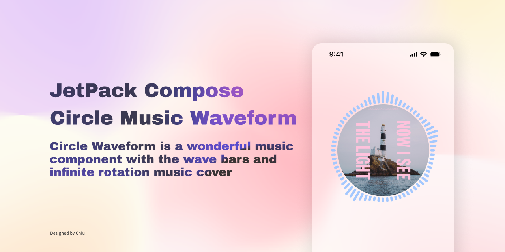
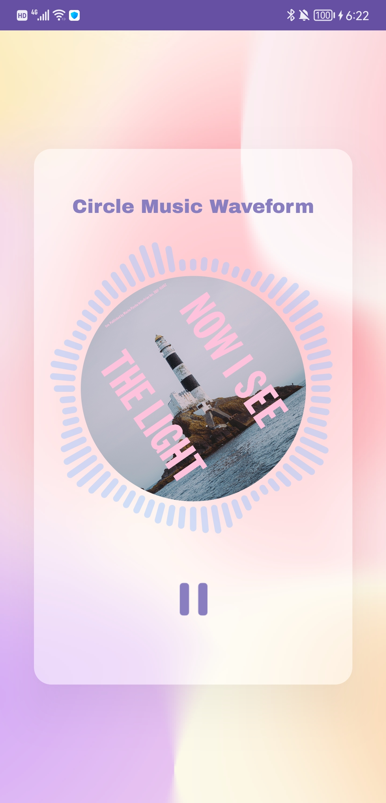
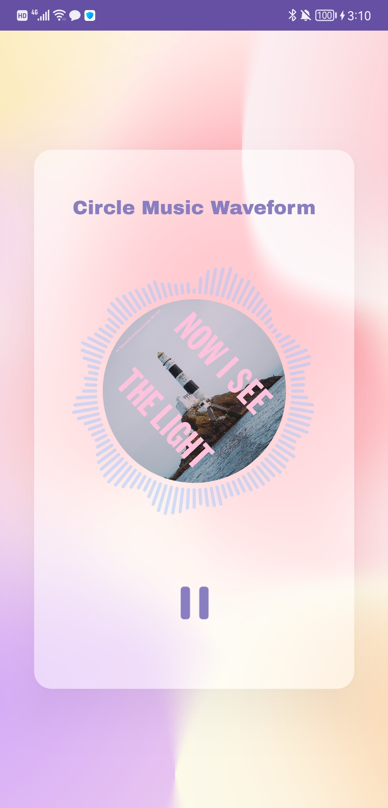

</br>
# CircleMusicWaveform
Circle Music Waveform is a UI component based on Jetpack compose. It waves with your music going. And the music cover keeps spinning.

## Preview


## How to get start
Please use JDK 17 to build this project

## Features
You can customize the param of waveform. Such as
- Bar color
- Bar number
- Bar width

</br>
<div display: inline-block>
	
	
</div>

### CircleMusicWaveform
| parameter    | expiation |
| -------- | ------- |
| alpha  | The transparence of bar |
| radius | The circle radius |
| barWidth    ||
| barMinHeight ||
| barMaxHeight ||
| barCornerRadius | The corner radius of retangle bar |
| barNumber ||
| barHeights | List of each bar height. If you want bar to wave, make the list dynamica changing |
| isPlaying | True if a song is playing but not completed |
| isEnd | True if a song is completed |

### CircleMusicCover
| parameter    | expiation |
| -------- | ------- |
| cornerRadius | The radius of image |
| duration | The time duration(ms) of rotating from start to end |
| isPlaying | True if a song is playing but not completed. If True the image  keeps rotating otherwise stopping |
| rotatable | Defualt value is true. if enable it, the image will rotate infinitely |

## Installation
Add it in your root `build.gradle` at the end of repositories:

```gradle
allprojects {
	repositories {
		// ...
		maven { url 'https://jitpack.io' }
	}
}
```

Add the dependency in your app's `build.gradle` file
```gradle
 dependencies {
    implementation 'com.github.yozyyyqls:CircleMusicWaveform:1.0.0'
 }
 ```

## Usage
### Something you should know before
When you turn the device volumn off, the Android Visualizer can't capture waveform data. The UI of waveform won't wave as music going.

### How to get the wave data?
```kotlin
// 1. Implement the WaveRenderer interface, which is use for updating bar heights.
class CircleWaveformViewModel : ViewModel(), WaveRenderer {
    private lateinit var _waveData: MutableState<List<Int>>

    val waveData: MutableState<List<Int>>
        get() = _waveData
    
    override fun render(data: List<Int>) {
        // Update your view here.
        _waveData.value = data
    }
}

// 2. Create an WaveCustomize instance to config waveform. Every instance that implements WaveRenderer need to override this field.
// In this example we have 72 bars in the waveform. The width of each bar is 6dp.
CircleWaveformCustomize(12, 30, 72, 6, 6)

// 3. Initialize the MediaPlayer.
// 4. Pass the audioSessionId of Mediaplayer and the WaveRenderer to the WaveEngine.
class CircleWaveformViewModel : ViewModel(), WaveRenderer {
    fun init(context: Context) {
        mediaPlayer = MediaPlayer.create(context, R.raw.breathing)
        waveEngine = WaveEngine(mediaPlayer.audioSessionId, this@CircleWaveformViewModel)
    }
}

// 5. Start the music and the visualizer. Once you active the WaveEngine, the wave data will be captured and pass to the WaveRenderer.
fun play() {
    mediaPlayer.start()
    waveEngine.active = true // Start the WaveEngine by changing the acticve field.
}

fun pause() {
    mediaPlayer.pause()
    waveEngine.active = false
}

```

### Use Waveform UI component in compose
```kotlin
private val viewModel by viewModels<CircleWaveformViewModel>()

Box(
    modifier = Modifier.wrapContentSize(),
    contentAlignment = Alignment.Center
) {
    // ============== The main UI part ================
    CircleWaveform(
        Modifier
            .fillMaxWidth()
            .height(320.dp),
        radius = 90.dp,
        barCornerRadius = viewModel.customize.barCornerRadius.dp,
        barWidth = viewModel.customize.barWidth.dp,
        barHeights = viewModel.waveData.value,
        barMinHeight = viewModel.customize.barMinHeight.dp,
        barMaxHeight = viewModel.customize.barMaxHeight.dp,
        barNumber = viewModel.customize.barNumber,
        color = BlueGrey,
        isPlaying = viewModel.isPlaying,
        isEnd = viewModel.isEnd
    )
    CircleMusicCover(
        Modifier
            .width(170.dp)
            .height(170.dp),
        R.drawable.img_music_cover,
        cornerRadius = 210.dp,
        isPlaying = viewModel.isPlaying
    )
    // ============== The main UI part ================
}
```
>Note: The circle waveform and the music cover are two seperate component. You need to put them together by yourself.

### If you need to stop the animation of waveform and music cover
1. Create a playing and an end state.
```kotlin
class CircleWaveformViewModel : ViewModel(), WaveRenderer {
    private val _isPlaying by mutableStateOf(false) // True if a song is playing but not completed
    var isPlaying: Boolean
        get() = _isPlaying
        set(value) {
            _isPlaying = value
        }

    private var _isEnd by mutableStateOf(false) // True if a song is completed
    val isEnd: Boolean
        get() = _isEnd
}
```

2. Pass the state to compose function.
```kotlin
CircleWaveform(
        Modifier
            .fillMaxWidth()
            .height(320.dp),
        radius = 110.dp,
        barCornerRadius = viewModel.customize.barCornerRadius.dp,
        barWidth = viewModel.customize.barWidth.dp,
        barHeights = viewModel.waveData.value,
        barNumber = viewModel.customize.barNumber,
        color = BlueGrey,
        isPlaying = viewModel.isPlaying, // <---Here
        isEnd = viewModel.isEnd
)
CircleMusicCover(
    Modifier
        .width(210.dp)
        .height(210.dp),
    R.drawable.img_music_cover,
    cornerRadius = 210.dp,
    isPlaying = viewModel.isPlaying, // <---Here
)
```

3. Then you just need to change the value of the playing state.
```kotlin
Image(
    modifier = Modifier
        .width(72.dp)
        .height(72.dp)
        .clip(RoundedCornerShape(72.dp))
        .clickable(
            interactionSource = interactionSource,
            indication = null // disable the touch ripple effect
        ) {
            // ===================== Here ========================
            viewModel.isPlaying = !viewModel.isPlaying
            if (viewModel.isPlaying) {
                viewModel.play()
            } else {
                viewModel.pause()
            }
            // ===================== Here ========================
        },
    painter = painterResource(id = if (!viewModel.isPlaying) R.drawable.ic_player_pause else R.drawable.ic_player_start),
    contentDescription = "",
)
```
