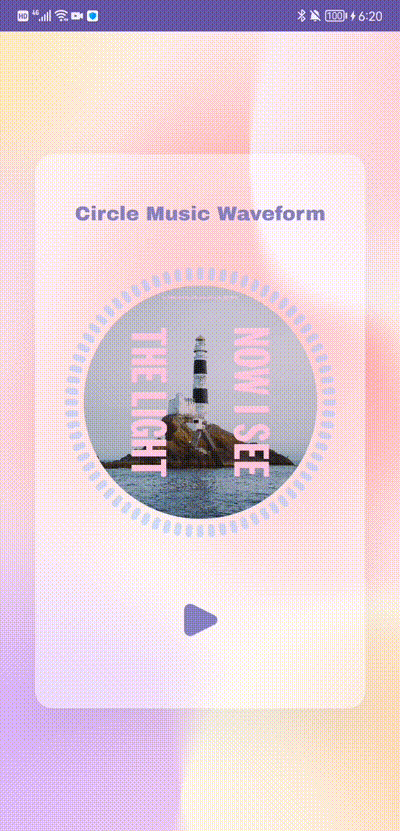

</br>
# CircleMusicWaveform
## Preview



## How to get start
Please use JDK 17 to build this project

## Feature

## Installation
Add it in your root `build.gradle` at the end of repositories:

```gradle
allprojects {
	repositories {
		...
		maven { url 'https://jitpack.io' }
	}
}
```

Add the dependency in your app's `build.gradle` file
```gradle
 dependencies {
         implementation 'com.yozyyy.circlemusicwaveform:waveform:1.0.0'
 }
 ```

## Usage
### Get the wave data
```kotlin
// 1. Implement the WaveRenderer interface, which is use for capturing wave data and updating bar heights.
class CircleWaveformViewModel : ViewModel(), WaveRenderer {
    private lateinit var _waveData: MutableState<List<Int>>

    val waveData: MutableState<List<Int>>
        get() = _waveData
    
    override fun render(data: List<Int>) {
        _waveData.value = data
    }
}

// 2. Create an WaveCustomize instance to store waveform paramter in WaveRenderer.
// In this example we have 72 bars in the waveform. The width of each bar is 6dp.
CircleWaveformCustomize(12, 30, 72, 6, 6)

// 3. Initialize the WaveEngine and prepare a MediaPlayer.
// 4. Pass the WaveRenderer to the WaveEngine.
class CircleWaveformViewModel : ViewModel(), WaveRenderer {
    fun init(context: Context) {
        mediaPlayer = MediaPlayer.create(context, R.raw.breathing)
        waveEngine = WaveEngine(mediaPlayer.audioSessionId, this@CircleWaveformViewModel)
    }
}

// Start the music and the visualizer. Once you active the WaveEngine, the wave data will be captured and pass to the WaveRenderer.
fun play() {
    mediaPlayer.start()
    waveEngine.active = true
}

fun pause() {
    mediaPlayer.pause()
    waveEngine.active = false
}

```

### Use Waveform UI component in compose
```kotlin
private val viewModel by viewModels<CircleWaveformViewModel>()

Box(
    modifier = Modifier.wrapContentSize(),
    contentAlignment = Alignment.Center
) {
    // ============== The main UI part ================
    CircleWaveform(
        Modifier
            .fillMaxWidth()
            .height(320.dp),
        radius = 110.dp,
        barCornerRadius = viewModel.customize.barCornerRadius.dp,
        barWidth = viewModel.customize.barWidth.dp,
        barHeights = viewModel.waveData.value,
        barNumber = viewModel.customize.barNumber,
        color = BlueGrey,
        isPlaying = viewModel.isPlaying.value
    )
    CircleMusicCover(
        Modifier
            .width(210.dp)
            .height(210.dp),
        R.drawable.img_music_cover,
        cornerRadius = 210.dp,
        isPlaying = viewModel.isPlaying.value
    )
    // ============== The main UI part ================
}
```
>Note: The circle waveform and the music cover are two seperate component. You need to put them together by yourself.

### If you need to stop the animation of waveform and music cover
1. Create a playing state.
```kotlin
class CircleWaveformViewModel : ViewModel(), WaveRenderer {
    private val _isPlaying: MutableState<Boolean> = mutableStateOf(false)

    val isPlaying: MutableState<Boolean>
        get() = _isPlaying
}
```

2. Pass the playing state to compose function.
```kotlin
CircleWaveform(
        Modifier
            .fillMaxWidth()
            .height(320.dp),
        radius = 110.dp,
        barCornerRadius = viewModel.customize.barCornerRadius.dp,
        barWidth = viewModel.customize.barWidth.dp,
        barHeights = viewModel.waveData.value,
        barNumber = viewModel.customize.barNumber,
        color = BlueGrey,
        isPlaying = viewModel.isPlaying.value // <---Here
)
CircleMusicCover(
    Modifier
        .width(210.dp)
        .height(210.dp),
    R.drawable.img_music_cover,
    cornerRadius = 210.dp,
    isPlaying = viewModel.isPlaying.value // <---Here
)
```

3. Then you just need to change the value of the playing state.
```kotlin
Image(
    modifier = Modifier
        .width(72.dp)
        .height(72.dp)
        .clip(RoundedCornerShape(72.dp))
        .clickable(
            interactionSource = interactionSource,
            indication = null // disable the touch ripple effect
        ) {
            // ===================== Here ========================
            viewModel.isPlaying.value = !viewModel.isPlaying.value
            if (viewModel.isPlaying.value) {
                viewModel.play()
            } else {
                viewModel.pause()
            }
            // ===================== Here ========================
        },
    painter = painterResource(id = if (!viewModel.isPlaying.value) R.drawable.ic_player_pause else R.drawable.ic_player_start),
    contentDescription = "",
)
```
